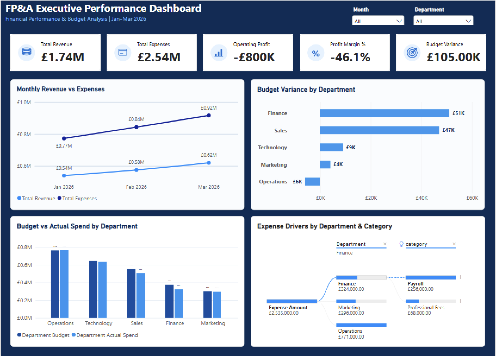

# FP&A SQL & Power BI Dashboard

An end-to-end Financial Planning & Analysis (FP&A) project built using **MySQL, SQL, Power BI, Power Query and DAX**.

The project analyses financial performance, budget vs actual spend, departmental variances and expense drivers through an interactive executive dashboard.

## Dashboard Preview



## Project Objective

The objective of this project was to build a management-focused FP&A reporting solution that can:

- Monitor revenue, expenses and operating profitability
- Compare budget against actual expenditure
- Identify favourable and unfavourable departmental variances
- Analyse monthly financial performance
- Investigate the underlying drivers of expenditure
- Allow users to filter results by month and department

## Tools Used

- **MySQL**
- **SQL**
- **Power BI Desktop**
- **Power Query**
- **DAX**
- **GitHub**

## Key KPIs

| KPI | Result |
|---|---:|
| Total Revenue | £1.735M |
| Total Expenses | £2.535M |
| Operating Profit | (£800K) |
| Profit Margin | -46.1% |
| Budget Variance | £105K favourable |

## Dashboard Analysis

### Monthly Revenue vs Expenses
Tracks monthly revenue and expenditure trends across January to March 2026.

### Budget Variance by Department
Highlights which departments are under or over budget and helps identify the largest variance contributors.

### Budget vs Actual Spend by Department
Compares planned departmental budgets against actual expenditure.

### Expense Drivers Analysis
Uses a Power BI decomposition tree to drill into expense drivers by **department and expense category**.

### Interactive Filters
The dashboard includes:

- Month slicer
- Department slicer

These allow users to explore financial performance from different reporting perspectives.

## SQL Work Completed

The SQL stage of the project included:

- Relational table design
- Primary and foreign keys
- Data-quality checks
- Aggregations
- `CASE` expressions
- `JOIN` operations
- Common Table Expressions (CTEs)
- Window functions
- Ranking
- Running totals
- `LAG`
- Budget variance calculations
- Profitability analysis
- Analytical SQL views
- Query-performance indexing

Key analytical views created included:

- `vw_monthly_kpis`
- `vw_department_performance`
- `vw_transaction_detail`

## Data Quality Controls

The project included SQL checks for:

- Invalid transaction records
- Invalid transaction types
- Invalid budget records
- Duplicate monthly budgets

The final validation returned no identified issues in these checks.

## Power BI Data Model

The Power BI model uses dedicated dimension tables for:

- **Date**
- **Department**

These connect to the financial transaction, monthly KPI and departmental-performance datasets to support interactive filtering and analysis.

## DAX Measures

Key measures include:

- Total Revenue
- Total Expenses
- Operating Profit
- Profit Margin %
- Total Budget
- Budget Variance
- Department Budget
- Department Actual Spend
- Department Variance
- Department Variance %
- Expense Amount

## Key Findings

- Total expenses exceeded total revenue during the analysis period, producing an operating loss of approximately **£800K**.
- Overall profit margin was approximately **-46.1%**.
- Despite the operating loss, total expenditure was approximately **£105K below budget overall**, showing that budget control and profitability were telling different stories.
- Department-level variance analysis helps identify where favourable and unfavourable spending differences originated.
- The decomposition tree provides a drill-down view of the expense categories driving departmental expenditure.

## Repository Structure

```text
fpa-sql-powerbi-dashboard/
│
├── README.md
├── FPA_Executive_Performance_Dashboard.pbix
├── fpa_analysis.sql
└── dashboard-overview.png
```

## Skills Demonstrated

**SQL | MySQL | Power BI | DAX | Power Query | FP&A | Financial Analysis | Budget Analysis | Variance Analysis | Data Modelling | Data Visualisation | Dashboard Design**

## How to View the Project

- The dashboard preview is available directly in this README.
- The `.pbix` file can be downloaded and opened using **Power BI Desktop on Windows**.
- The SQL file contains the analysis and database logic used in the project.

## Notes

This project was created as a portfolio case study to demonstrate practical SQL, financial analysis and Power BI reporting skills.
